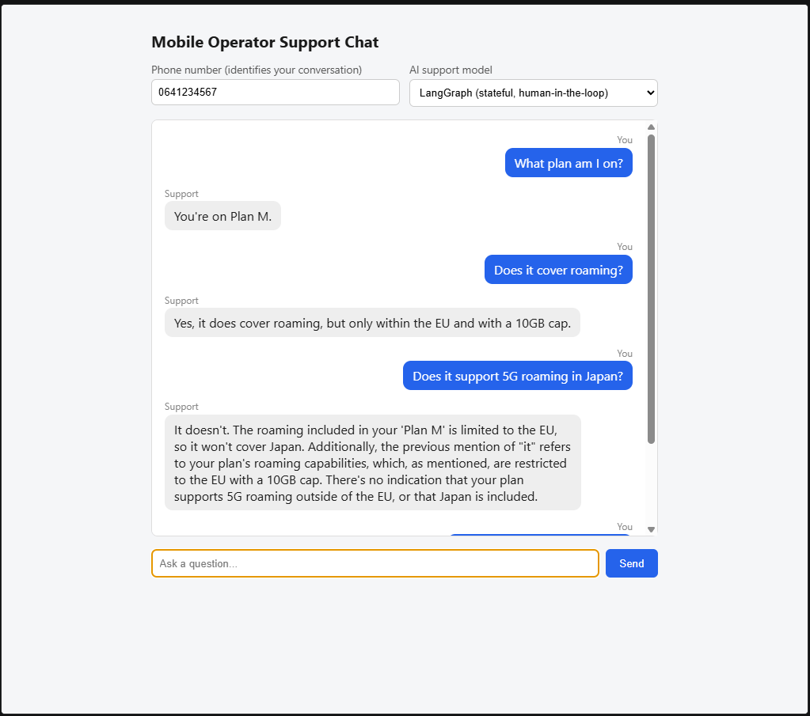

# MobileOperator_AgenticAI

Sample Python scripts demonstrating **Agentic AI patterns** with **LangChain** and **LangGraph**, using a mobile operator customer support scenario.

These examples progress from basic LangChain agent concepts to advanced LangGraph stateful systems, showing how LLMs can independently reason, call tools, and maintain conversation context.

---

## 📸 Screenshot



The Flask chat page (`web/app.py`), backend set to LangGraph: `followup_prompt` correctly grounds "Does it cover roaming?" in the account's actual roaming data, and correctly declines the 5G/Japan question instead of guessing since nothing in `FAKE_ACCOUNTS` covers it.

---

## ⚠️ Not Suitable for Render's Free Tier

Attempted deploying `web/app.py` there and hit `Out of memory (used over 512Mi)` at every start. Importing `llm/langchain_agent.py` loads PyTorch + `sentence-transformers` for local `HuggingFaceEmbeddings`, builds a FAISS index, and parses/embeds `plans_handbook.pdf` — all in-process, at startup. That alone exceeds the free (and Starter — same 512MB RAM, more CPU only) plan's memory cap; Standard ($25/mo, 2GB RAM) is the first tier with enough headroom. Run it locally instead (see [Run the Flask Chat Page](#run-the-flask-chat-page)).

---

## 📋 Overview

Two agent implementations solve the same domain (mobile operator support queries), each reachable through both a FastAPI service and a Flask chat page - both HTTP layers let a caller pick which agent answers, per request:

```
MobileOperator_AgenticAI/
├── llm/
│   ├── langchain_agent.py    # LangChain ReAct agent (tools, RAG, JSON parsing)
│   └── langgraph_agent.py    # LangGraph StateGraph agent (compiled `app`)
├── api/
│   └── main.py                # FastAPI wrapper - POST /chat picks the agent via `backend`
├── web/
│   ├── app.py                  # Flask chat page - same choice, picked via a dropdown
│   └── templates/chat.html
├── test/
│   ├── test_api.py             # Integration tests for POST /chat (both backends)
│   ├── test_langgraph_agent.py # Direct tests against the compiled LangGraph agent
│   └── test_langchain_agent.py # Direct tests against langchain_agent.py's tools/retrievers
├── conftest.py                 # Test bootstrap (sys.path, dummy API key)
└── plans_handbook.pdf
```

| Feature | `llm/langchain_agent.py` | `llm/langgraph_agent.py` | `api/main.py` / `web/app.py` |
|---------|--------|---------|---------|
| **Framework** | LangChain (`AgentExecutor`) | LangGraph (`StateGraph`) | FastAPI or Flask, wrapping EITHER agent |
| **Agent Type** | ReAct loop (autonomous multi-step) | Stateful graph with conditional routing | Picked per-request via a `backend` field/dropdown |
| **Memory** | ConversationBufferMemory | MemorySaver checkpointer (persistent) | MemorySaver (LangGraph) or a `phone_number -> AgentExecutor` dict (LangChain) |
| **Tool Calling** | Full agent loop: picks tools, observes results, re-reasons | Limited: no dynamic tool calls shown | Delegates to whichever agent handled the request |
| **Conversation** | Single multi-turn session in one `.invoke()` call | Turn-by-turn (separate `.invoke()` per message) | Turn-by-turn HTTP requests either way |
| **Human-in-Loop** | Not implemented | ✅ Implemented (interrupt/resume for sensitive actions) | ✅ Supported for LangGraph requests; LangChain requests have no equivalent - a refund question just gets answered directly |
| **Use Case** | Chatbot with complex reasoning and multi-tool orchestration | Real-world app: stateful user sessions across invocations | Production web service or demo page, letting callers compare both agents live |
| **Complexity** | Intermediate (covers many concepts) | Advanced (graph-based state management + interrupts) | Production-ready (web API layer) |

`api/main.py` and `web/app.py` each keep their OWN LangChain session store - a conversation started through one won't carry over if continued through the other.

---

## 🆚 FastAPI vs Flask

**FastAPI** is API-first:<br>
It excels at JSON endpoints, auto-generates OpenAPI/Swagger docs, and gives you async + Pydantic auto-mapping/validation (via request/response models, e.g. `ChatRequest`/`ChatResponse` in `api/main.py`).<br>
It can render HTML (via `Jinja2Templates`/`StaticFiles`), but you have to wire that up yourself — no `/templates` folder auto-scan like Flask does, and the `request` parameter must be explicitly defined and passed into the template response (boilerplate code).

**Flask** is the opposite default:<br>
Jinja2 templating and `render_template()` are built in from the start, so returning an HTML page needs no boilerplate (`web/app.py`'s `index()` view).<br>
It's equally capable of being a pure JSON API (`jsonify()` everywhere, no HTML at all), but it doesn't provide auto-mapping/validation (no request/response model) or OpenAPI docs the way FastAPI does — request data has to be pulled out of `request.get_json()`/`request.args` by hand.

---

## 🔗 API Keys & Environment

```bash
export GROQ_API_KEY=gsk-...
```

All scripts use Groq's free-tier `llama-3.3-70b-versatile` for the LLM. `llm/langchain_agent.py`'s embeddings run locally via `HuggingFaceEmbeddings` (`sentence-transformers/all-MiniLM-L6-v2`), so no key or network call is needed for the vector store. Swap either model name to use a different LLM/embedding model.

---

## 📝 Fake Data

All scripts use mocked account data instead of real databases:

```python
FAKE_ACCOUNTS = {
    "0641234567": {
        "plan": "Plan M",
        "data_left_gb": 3.2,
        "roaming_included": "EU only, 10GB cap"
    }
}
```

Replace with real calls (SQL DB, REST API, gRPC) to ground queries in actual user data.

---

## 🚀 Quick Start

### Prerequisites

```bash
pip install langchain langchain-groq langchain-huggingface langchain-community langgraph faiss-cpu pypdf pydantic fastapi uvicorn
export GROQ_API_KEY=gsk-...
```

For running the test suite, also install:

```bash
pip install pytest httpx
```

For PDF example: ensure `plans_handbook.pdf` exists in the working directory.

### Run LangChain Example (Standalone)

```bash
python -m llm.langchain_agent
```

> **Not interactive** — `if __name__ == "__main__":` (`llm/langchain_agent.py:305-338`) runs a fixed sequence of predefined, hardcoded questions/scenarios and prints each result, back to back. To try your own questions instead, either edit those calls directly or import the pieces (`agent_executor`, `extract_chain`, `pdf_retriever`, etc.) into your own script.

Demonstrates:
- JSON output parsing (structured classification)
- Tool calling (single-step, manual)
- ReAct agent loop (autonomous multi-step)
- RAG (knowledge base + PDF retrieval)

### Run LangGraph Example (Standalone)

```bash
python -m llm.langgraph_agent
```

> **Not interactive** — the `__main__` block runs a fixed sequence of predefined `app.invoke()` calls (including a deliberately sensitive one, to trigger the human-in-the-loop `interrupt()`) and prints each result. Edit those calls directly, or import `app`/`agent_graph` to drive it with your own input.

Demonstrates:
- Graph-based state machine
- Conditional routing (branching logic)
- Loops/cycles within a turn
- Cross-turn memory via checkpointing
- **Human-in-the-loop:** interrupt/resume for sensitive operations (e.g., refunds)

### Run the HTTP API

```bash
# Terminal 1: Start the FastAPI server
uvicorn api.main:api --reload

# Terminal 2: Test the endpoint (defaults to the LangGraph agent)
curl -X POST http://localhost:8000/chat \
  -H "Content-Type: application/json" \
  -d '{"phone_number": "0641234567", "question": "What plan am I on?"}'

# Same endpoint, LangChain agent instead - add "backend": "langchain"
curl -X POST http://localhost:8000/chat \
  -H "Content-Type: application/json" \
  -d '{"phone_number": "0641234567", "question": "What plans do you offer?", "backend": "langchain"}'
```

> **How to use:**
> `api/main.py` is API-only — no chat page of its own (that's what the Flask app below is for).
> It's not curl-only either, though — FastAPI auto-generates an interactive docs UI.
> Opening **http://localhost:8000/docs** (Swagger) or **http://localhost:8000/redoc** in a browser lets you try `/chat` and `/health` from a form instead of the command line.
> No separate template/route needed for that — it comes from the `ChatRequest`/`ChatResponse` Pydantic models already on the endpoint.

The API exposes:
- **POST `/chat`** — stateful chat endpoint (`phone_number` = thread_id / session key; `backend` = `"langgraph"` (default) or `"langchain"`)
- **GET `/health`** — health check for load balancers

### Run the Flask Chat Page

```bash
pip install flask
python -m web.app
```

> **How to use:**<br>
> Open http://127.0.0.1:5000 — a chat UI (phone number + question box) backed by both agents, with a dropdown to switch between them per message.<br>
> It's a fully standalone, single-process app (frontend+api+both agents directly) rather than a separate frontend for the FastAPI service, so there's nothing else to run and no CORS to configure.<br>
> If a request needs human approval (e.g. a refund) while the LangGraph backend is selected, it gets the same safe fallback message as the FastAPI endpoint rather than pausing for approval; the LangChain backend has no such concept at all and just answers directly.

### Run the Test Suite

```bash
pytest
```

- `test/test_api.py` hits `POST /chat` through FastAPI's `TestClient`. The LangGraph cases cover the same four scenarios as `llm/langgraph_agent.py`'s `__main__` demo: a new conversation, a follow-up resolved via the checkpointer, the clarify/retry loop, and a sensitive (refund) request hitting the human-in-the-loop `interrupt()`. The LangChain cases (`backend: "langchain"`) cover `api/main.py`'s own session dispatch - phone number embedding and per-phone-number `AgentExecutor` reuse - with a fake executor standing in for the whole agent.
- `test/test_langgraph_agent.py` calls the compiled graph directly (`agent_graph.invoke()`/`get_state()`), skipping the FastAPI layer, to cover what the HTTP-level tests structurally can't reach: the `Command(resume=...)` approve/deny round trip (`api/main.py` never calls it), the checkpointer's persisted state verified directly rather than inferred from output text, and cross-thread isolation. It deliberately leaves out a standalone "interrupt pauses"/"clarify loop stops at MAX_RETRIES" test — those would just re-run the same code path `test_api.py` already asserts on via HTTP, with no added coverage.
- `test/test_langchain_agent.py` calls `llm/langchain_agent.py`'s tools (`get_account_usage`, `check_network_outage`, `search_plans_kb`) and retriever variants (plain, MMR/diverse, metadata-filtered, score-threshold) directly - all real and deterministic, since none of them touch the LLM. `agent_executor`, `extract_chain`, and `llm_with_tools` bind the real `ChatGroq` at import time (unlike `langgraph_agent.py`'s nodes, which look it up fresh per call), so they can't be faked the same way and aren't covered here.

The real `ChatGroq` LLM is swapped for a `FakeListChatModel` wherever `langgraph_agent.py` is involved, so no `GROQ_API_KEY` or network access is needed to run those tests. Caution: `FakeListChatModel` ignores its input entirely and just cycles through canned responses - it proves graph routing/state is correct, not that the right context was actually sent to the LLM. `test_langchain_agent.py` sidesteps the LLM question altogether by only testing tool/retriever logic that never calls it; it does still need network access on first run, to download the local embedding model.

---

## 🛠️ Concepts Covered

### All Scripts

- ✅ **LLM** (ChatGroq)
- ✅ **Prompt Engineering** (PromptTemplate, structured formats)
- ✅ **LangChain** (LCEL pipes: `prompt | llm | parser`)
- ✅ **Context Engineering** (injecting facts into prompts)
- ✅ **Context-Augmented Generation** (account info, format instructions)

### LangChain-Only

- ✅ **Vector Database** (FAISS)
- ✅ **RAG** (retriever, embeddings, PDF ingestion)
- ✅ **Tool System** (@tool, bind_tools, tool calling)
- ✅ **Agent Loop** (ReAct: Thought/Action/Observation)
- ✅ **Memory** (ConversationBufferMemory)
- ✅ **JSON Parsing** (JsonOutputParser, validation)

### LangGraph & API

- ✅ **Graph Nodes** (functions, state mutations)
- ✅ **Conditional Routing** (branching logic based on state)
- ✅ **Cycles** (loops within one turn)
- ✅ **Checkpointing** (state persistence across invocations / HTTP requests)
- ✅ **State Management** (TypedDict, immutable updates)
- ✅ **Human-in-the-Loop** (`interrupt()` pauses sensitive operations, `Command(resume=...)` approves/denies)
- ✅ **Thread Management** (phone_number as thread_id for per-user sessions)

### Future Implementations

- 🔨 **Streaming** (.stream, .astream)
- 🔨 **Async** (.ainvoke)
- 🔨 **Parallel Execution** (fan-out, Send)
- 🔨 **Subgraphs** (nested graphs)
- 🔨 **ToolNode** (integrated tool execution)
- 🔨 **Time Travel** (state history replay)

---

## 🔑 Key Architectural Differences

### LangChain (One Big Session)

```python
# All turns in one call
memory = ConversationBufferMemory()
agent = create_react_agent(llm, tools, prompt)
executor = AgentExecutor(agent=agent, tools=tools, memory=memory)

# Turn 1 + Turn 2 + Turn 3 in sequence, same memory object
r1 = executor.invoke({"input": "..."})
r2 = executor.invoke({"input": "..."})  # memory carries turn 1 automatically
```

**Pros:** Simple, memory implicit  
**Cons:** Doesn't match request/response HTTP model

### LangGraph (Turn-by-Turn, Checkpointed)

```python
# State persisted across calls
memory = MemorySaver()
app = graph.compile(checkpointer=memory)
config = {"configurable": {"thread_id": "user123"}}

# Turn 1
r1 = app.invoke({"input": "..."}, config=config)
# ... HTTP response sent, user types next message ...
# Turn 2
r2 = app.invoke({"input": "..."}, config=config)  # checkpointer reloads state
```

**Pros:** Matches stateful web app architecture  
**Cons:** Requires explicit thread_id management

### LangGraph with Human-in-the-Loop

```python
# Sensitive operations can pause and wait for human approval
config = {"configurable": {"thread_id": "user123"}}

# Request triggers an interrupt()
result = app.invoke({"input": "refund my plan"}, config=config)
if "__interrupt__" in result:
    # A human reviews the request...
    result = app.invoke(Command(resume=True), config=config)  # Same thread_id
```

**Pros:** Real-world requirement for sensitive operations; checkpointer keeps state while paused  
**Cons:** Requires external mechanism (agent UI, approval queue) to resume

### FastAPI + LangGraph (Production Web Service)

```python
@api.post("/chat")
def chat(request: ChatRequest) -> ChatResponse:
    config = {"configurable": {"thread_id": request.phone_number}}
    result = agent_graph.invoke({"phone_number": ..., "question": ...}, config=config)
    return ChatResponse(answer=result["answer"], retry_count=result["retry_count"])
```

**Pros:** Stateless HTTP layer (thread_id manages state), scalable, standard JSON API  
**Cons:** API layer must handle sensitive operation results (e.g., `__interrupt__` pauses)

### Runtime Backend Selection (`api/main.py` and `web/app.py`)

Both HTTP layers wrap EITHER agent behind the same request shape, dispatching on a `backend` field instead of exposing two separate endpoints - the two agents return the same shape (an answer string), so a second endpoint would only duplicate request/response boilerplate for no real separation of concerns:

```python
langchain_sessions: dict[str, AgentExecutor] = {}  # AgentExecutor has no built-in session store

def chat(phone_number: str, question: str, backend: str = "langgraph"):
    if backend == "langchain":
        if phone_number not in langchain_sessions:
            langchain_sessions[phone_number] = build_agent_executor()
        # AgentExecutor only ever sees free-text "input" - the tools need
        # phone_number as an argument, so it has to be embedded in the text
        result = langchain_sessions[phone_number].invoke(
            {"input": f"(My phone number is {phone_number}.) {question}"}
        )
        return result["output"]

    config = {"configurable": {"thread_id": phone_number}}
    result = agent_graph.invoke({"phone_number": phone_number, "question": question, "retry_count": 0}, config=config)
    return "This request needs review by a support agent." if "__interrupt__" in result else result["answer"]
```

**Pros:** One request shape, easy side-by-side comparison of both agents  
**Cons:** `AgentExecutor` has no checkpointer, so each HTTP layer has to build and hold its own `phone_number -> AgentExecutor` session dict by hand; `api/main.py` and `web/app.py` keep separate dicts, so a LangChain conversation doesn't carry over between them

---

## 🎯 Use Cases

### LangChain Example (`llm/langchain_agent.py`)

- **Customer support chatbot** with multi-turn problem solving
- **Document Q&A** with real PDF retrieval
- **Knowledge base search** with diverse results (MMR)
- **Autonomous tool orchestration** (model decides what to call)

### LangGraph Example (`llm/langgraph_agent.py`)

- **Session-based application** (stateful across invocations)
- **User thread management** (one thread per user ID)
- **Retry/clarification loops** (internal to one turn)
- **Human approval workflows** (interrupt before sensitive actions)
- **Real-world customer support system** (matches typical architecture)

### FastAPI Example (`api/main.py`)

- **Production HTTP API** serving either agent, picked per-request via `backend`
- **Per-user stateful sessions** (thread_id = phone_number for LangGraph; a `phone_number -> AgentExecutor` dict for LangChain)
- **Scalable multi-user support** (checkpointer handles LangGraph state, not the API)
- **Integration point** for external approval systems (human-in-the-loop, LangGraph requests only)

### Flask Chat Page (`web/app.py`)

- **Side-by-side agent comparison** - a dropdown switches backends without restarting the server
- **Manual QA / demoing** both agents against the same fake account data in one page
- **Same session-handling caveats as the API** (separate LangChain session dict, no human-approval UI)

---

## 🚀 Next Steps

1. **Add real tools:** Replace FAKE_ACCOUNTS with actual database calls
2. **Add vector search:** Ingest real customer policies, not hardcoded strings
3. **Stream responses:** Use `.stream()` for real-time feedback
4. **Monitor & trace:** Use LangSmith to debug agent behavior
5. **Deploy the API:** Use Docker + a production ASGI server (Gunicorn + Uvicorn)
6. **Wire up human approval:** Build an admin UI or approval queue for sensitive operations (paused via `interrupt()`)
7. **Unify LangChain sessions:** `api/main.py` and `web/app.py` currently keep separate `phone_number -> AgentExecutor` dicts - move that store somewhere both import from, or replace it with a real cache/DB, so a conversation carries over between the two
8. **Add human-in-the-loop to LangChain:** unlike the LangGraph agent, `langchain_agent.py` has no refund tool or approval step - a refund question just gets answered directly by the ReAct loop
